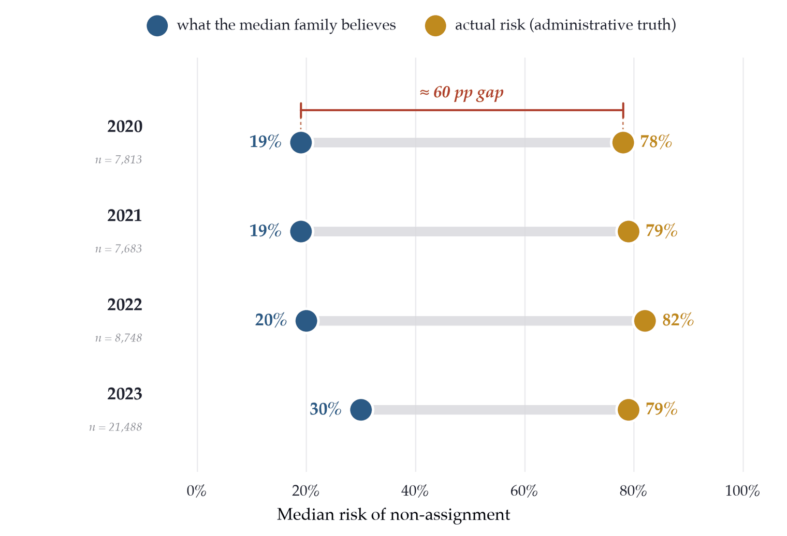
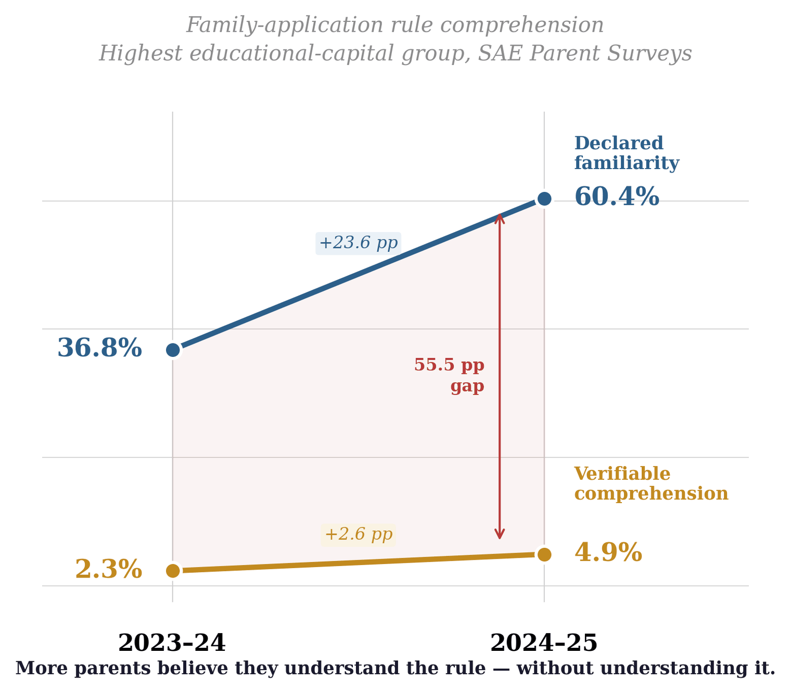
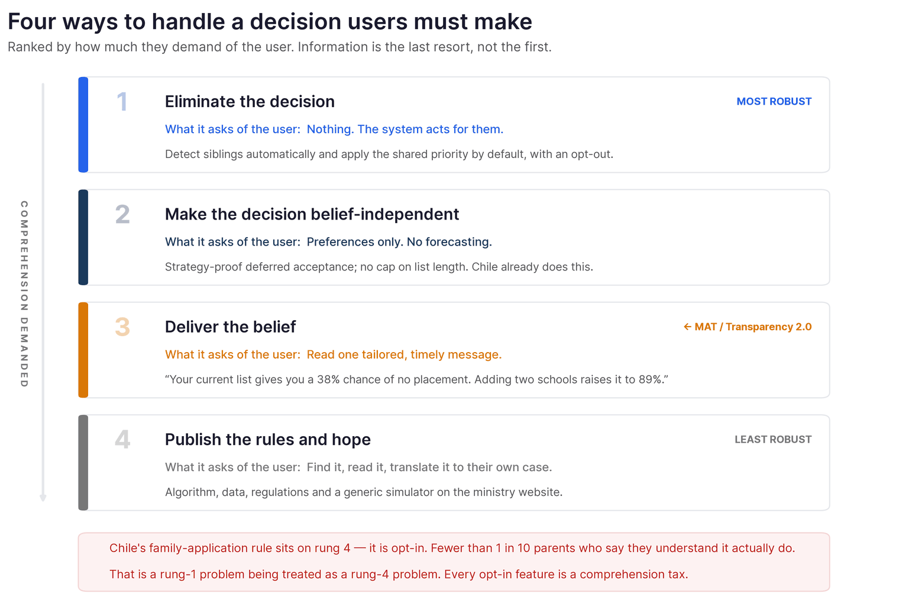

It is August in Santiago, and a mother is finishing the form that decides where her son goes to school next year. She has listed five schools. She feels reasonably good about it — asked to put a number on her chances, she'd say about eight in ten.

Run the published algorithm on the list she just submitted and her real chance of getting **none** of those five is about eight in ten.

Nobody tells her. The window closes. In March her son starts at a school she never listed.

That family is a composite. The arithmetic is not. Across four admissions cycles and roughly 140,000 surveyed families, among applicants the platform can identify *in advance* as high-risk, the median family put their risk of going unassigned at around 20 percent when it was actually around 80 percent — a gap of 49 to 62 points, in every single cycle.

<figure>

  

  <figcaption>Among applicants the system can flag in advance as high-risk, believed risk sits roughly 60 points below the truth — in every cycle.</figcaption>
</figure>

## The theory of change we have been running on

Over the last decade governments have got much better at showing their work. Algorithm registries, transparency recording standards, impact assessments, public audit frameworks: the machinery of algorithmic accountability has grown quickly. The most comprehensive map to date, the GPAI's 2025 state-of-the-art report, catalogues 83 public-algorithm repositories across four continents.

Almost all of it rests on one theory of change: **publish the system, and accountability follows.** Make the code, the rules and the data available, and experts, auditors, journalists and motivated citizens will do the rest.

Call this **Formal Transparency**, or Transparency 1.0. It has two layers that are worth separating. There is a *formal* layer — the publicity of administrative acts and documents, aimed at the general public. And there is an *expert* layer — the ability to technically reproduce and audit the system's outputs, aimed at auditors and researchers. Both are necessary. Both are compatible with what we propose. Neither is sufficient, and the reason is that the compliance test for both is the *existence and accessibility of artifacts*, not whether anyone understood anything.

The field has started to notice. Nieuwenhuizen asks whether algorithm registers are "a box-ticking exercise or a meaningful tool for transparency." Cath and Jansen warn against "romanticizing the registry as a governance solution." Studying Colombia's public-algorithm repositories, Gutiérrez and Muñoz-Cadena diagnose **performative transparency**: information about automated systems used to project efficiency and innovation, without enabling citizens to know when a system is being used on them or what it does with their data.

Performative transparency is easy to allege and hard to prove. What follows is an attempt to measure it.

## Why school assignment is the sharpest test

Coordinated choice and assignment systems now allocate school and university seats at national scale — roughly 60 percent of 149 countries surveyed operate some version of one. These platforms decide which child attends which school using genuinely complex rules: priority structures, tie-breaking, quotas, sibling links.

What makes them the sharpest test of algorithmic transparency is the user. The affected party is not an auditor with time and expertise. It is a family with a three-week window, a phone, and one shot at getting it right.

## Chile is the best case, not the average one

This is not a story about a government that hid its algorithm.

Chile's [Sistema de Admisión Escolar](/projects/sae-chile) places about 470,000 children a year. The algorithm is published. The application data is published. There is a public simulator, a school guide, explainer videos, help desks. The mechanism is strategy-proof — you cannot improve your odds by misrepresenting your preferences — and there is no limit on how many schools you may list. The GPAI report itself uses the SAE as an example of an automated decision system that families interact with directly.

If publishing a public algorithm is supposed to make it comprehensible to the people it governs, this is close to the best case available anywhere. Most systems are well below it. Denmark's reformed gymnasium admissions publish the cutoff transport time at which each school stopped admitting students — real information, but released *after* the cycle closes. It cannot be used to reproduce the assignment, and it cannot help a family decide where to apply, because this year's cutoff is unknowable until next year. That is a partial position inside Formal Transparency: it satisfies neither the publicity test in its strong form nor the expert-reproducibility test.

So if the comprehension gap survives in Chile, it is almost certainly larger everywhere that publishes less.

## Awareness is not understanding

Probabilities are hard, so we also looked at something that isn't.

Chile's family-application rule lets siblings be considered together under a shared priority. No forecasting required — you either know what it does or you don't. Between the 2023–24 and 2024–25 parent surveys, among parents with a university degree or higher, the share who said they understood the rule went from **36.8% to 60.4%**. The information campaigns worked.

The share who could correctly identify what the rule actually does went from **2.3% to 4.9%**.

<figure>

  

  <figcaption>Declared familiarity nearly doubled in a single year. Verified comprehension barely moved.</figcaption>
</figure>

Of the parents who declared they understood it, 6 to 8 percent actually did. For every 100 who said they knew, between 92 and 94 didn't.

That divergence — declared familiarity climbing while verified comprehension flatlines — is the operational signature of publication-centered transparency reaching its ceiling. It is also, usefully, a *number*: the distance between the two series is a measurable quantity, which is what turns "performative transparency" from an accusation into an indicator.

## The gap is not evenly distributed

At the *same* true risk, lower-income families are more wrong.

Among the highest-risk applicants, those whose mothers didn't finish high school understated their risk by an average of 68 percentage points; those whose mothers had tertiary education, by 54. Two independent measures of socioeconomic status show the same thing, and the gradient is statistically stable across all four cycles. It does not close on its own.

Now hold that against what the SAE was built for. It replaced a regime where schools selected students on academic merit and family background. It gives lower-income applicants explicit priority through reserved seats and a tie-breaker boost. And it delivers: those families face materially lower objective risk, in every cycle.

The mechanism is progressive. The information layer wrapped around it is not.

<figure>

  

  <figcaption>The priority structure lowers true risk for lower-income applicants. The information layer makes those same families more wrong about it.</figcaption>
</figure>

> The equity built into the algorithm stops at the interface.

## Five lines of evidence, one conclusion

No single measurement settles this. The force comes from convergence across methods, instruments and moments in the system's life:

1. A **randomized experiment** with Chilean parents: families systematically underestimate their risk of going unassigned, and a tailored proactive warning closes part of the gap and improves match quality.
2. A **causal-channel analysis** showing those effects run specifically through the correction of false beliefs — not general salience or encouragement.
3. An **operator report** from three consecutive cycles of running the algorithm, finding comprehension of the joint-application rule far below what families declare.
4. Our **population-scale calibration** against administrative truth, 2020–2023.
5. Our **rule-comprehension survey**, 2023–25.

Different methods, different instruments, different dimensions of complexity, same residual. And the pattern is inconsistent with the three explanations usually offered:

**Give it time.** The conditional gap is statistically flat across four annual cycles.

**The motivated will find out.** Verified comprehension is near the floor in the *most* educated group, and the miscalibrated high-risk families are precisely those with the strongest incentive to find out.

**Write a better FAQ.** Chile already runs an unusually well-resourced information effort. The gap persists through it.

What's left is structural: the paradigm requires users to convert available information into operative knowledge on their own initiative, and that conversion is a cost some families can pay and others can't. Equal nominal access, unequal effective uptake.

## Transparency 2.0: a different question

Formal Transparency asks: *can someone audit this algorithm?*

The next standard has to ask: *can this family anticipate what the algorithm will do with their application?*

We call it **Meaningful Algorithmic Transparency**. Its addressee is the applying family rather than the auditor. Its content is information that is **proactive** (delivered at the operator's initiative through concrete acts of notification, not merely made available through channels users are expected to consult), **tailored** (adapted to the user's decision context and to the needs of different groups of users, rather than assuming one homogeneous citizen), and **actionable** (delivered with enough time and in a form that lets the user change what they do).

Of the three, proactivity carries the most weight, and it operates on three planes at once. *Initiative*: delivery cannot depend on the user knowing what to look for, because the asymmetry about what is relevant is precisely the gap to be closed. *Salience*: the information must arrive designed as a critical notification, not as one option in a help menu. *Record*: the operator must be able to show the information was actually placed in the user's awareness.

And the compliance test changes. Under 1.0 you comply by holding the documents. Under MAT you comply by **measurable evidence that users can correctly anticipate how their actions map to outcomes**.

Two clarifications matter. MAT does not replace Formal Transparency — it presupposes it. A state that does not publish its algorithm cannot invoke MAT to avoid doing so. And MAT is not *more* of Formal Transparency: publishing more documents, translating them into plain language, improving the simulator are all improvements inside the old paradigm, and none of them satisfies the requirement to put case-specific information in front of a user at the moment of deciding.

## What the standard requires in practice

The paper turns that into six obligations an operator can be held to:

1. **Identify the moments of consequential choice.** Document, in advance, the points where users make decisions with foreseeable consequences. For the SAE: building the initial list, activating the family or joint-application options, and any change before the deadline.
2. **Perform a concrete act of placing information into awareness.** At each of those moments, a notification initiated by the operator, through a dedicated channel — not a page someone could have visited.
3. **Make it case-specific.** The risk implied by *this* list, and warnings tied to the choices actually entered, adapted where relevant to the needs of different groups of users.
4. **Make it actionable, with time to act.** A plain-language explanation of which available actions change the outcome and how, early enough to use.
5. **Measure operative comprehension, periodically.** Verification questions, pilots, user testing — with results published in aggregate, and the distance between declared familiarity and verified comprehension treated as an institutional indicator.
6. **Audit and correct.** Where the indicator shows persistent or unequal gaps, the operator documents corrective measures and their effects, and a competent oversight body can audit them and require adjustments.

Components five and six are what make this a standard rather than an aspiration. They are also the cheapest part: the measurement that produced the findings above is two survey questions and a re-run of an algorithm the state already publishes.

## It does not need a new law

This is the part most easily missed, and it is the largest section of the paper. Making MAT binding in Chile does not require a new algorithmic transparency statute. It requires articulating legal materials that already exist:

- **Access to information.** Law 20,285, read with the constitutional publicity principle and enforced by the Council for Transparency (CPLT), already covers Formal Transparency. The CPLT's Recommendations on Algorithmic Transparency (Resolution 372/2024) already extend transparency duties to the design, operation, data inputs and impact assessment of automated systems — the GPAI report highlights them as a leading international development. Their limitation is that they are not enforceable. And the CPLT has already instructed public bodies to adopt *proactive transparency* as a standard, which is the same move MAT generalizes.
- **Data protection.** Law 21,719, in force from December 2026 with a new supervisory agency, recognizes rights around automated decisions — information, explanation, human intervention, review. Its application to the public sector is contested, so these safeguards may have to be reconstructed through sector-specific competences in coordination with the CPLT.
- **Sector-specific regulation.** The SAE already has the platform families log into, a notification system for deadlines and results, and a data pipeline recording application behavior in real time. Delivering tailored information means adapting existing technical capacity, not building new institutions — the risk-warning experiment ran inside exactly this infrastructure.

Contrast that with the regulatory frontier. The EU AI Act classifies systems determining access to education as high-risk, which puts a mechanism like the SAE squarely in scope. But its transparency obligations run mainly to deployers, and the affected person's own entitlement is a right to obtain an explanation *once an adverse decision has been taken*. That duty is reactive and ex post. It leaves the applicant's comprehension *during* the application — the only moment when understanding could still change the outcome — outside the standard.

The architecture generalizes because the materials do. Many countries already hold functional equivalents: a mature access-to-information regime, an emerging data-protection framework, sector-specific digital platforms. What they lack is the deliberate articulation of those materials around user comprehension as the objective.

## A note for people who design these systems

One extension worth stating, which goes slightly beyond the paper. Before reaching for better information, it is worth asking whether the user needed to make the decision at all.

<figure>

  

  <figcaption>Ranked by how much each approach demands of the user. MAT sits at rung three; most systems operate at rung four.</figcaption>
</figure>

Chile's family-application rule is the case in point. It is **opt-in** — and fewer than one in ten parents who claim to understand it actually do. But the system already knows which applicants are siblings. The priority could be applied automatically, with an opt-out, requiring no comprehension from anyone. That is a rung-one problem being managed as a rung-four problem.

Note too where strategy-proofness sits. It is a genuine achievement, but it only makes the *ranking* safe to get wrong. Which schools to include, and how many, still depends entirely on what a family believes about their odds — and that residual is where the damage happens.

## The question is the same everywhere

Brazil's SISU allocates university seats to roughly two million applicants a year and has already generated evidence of strategic errors by applicants who do not understand how the algorithm processes their preferences. Kenya's centralized secondary-school placement publishes its criteria while their practical implications remain opaque to most families. India's Right to Education reservation involves algorithmic allocation at scale with minimal informational support. Colombia's SISBEN scoring, which gates a range of social programs, was flagged by the GPAI report itself as a case where algorithmic transparency has not translated into citizen comprehension.

In each, the policy question is Chile's: at what point does the state's obligation shift from making the algorithm auditable to making it understandable to the people whose lives it affects?

There is a democratic argument underneath the distributive one. The SAE exists because of a legislative commitment to non-discrimination in school admissions, and the political durability of that commitment depends on whether families perceive the system as fair. That perception depends on comprehension: a family that does not understand how the algorithm processed its application cannot meaningfully evaluate whether the outcome was fair, or contest it. Formal Transparency, however ambitious, does not produce that on its own.

When a comprehension shortfall is measurable, concentrated on the families a system was explicitly designed to help, and fixable by a method already demonstrated in randomized evidence and feasible on infrastructure that already exists, staying at publication-only transparency is no longer a neutral technical default.

It's a distributive choice.

---

*Disclosure: the empirical analysis uses SAE survey microdata held by Chile's Ministry of Education. ConsiliumBots implemented the SAE assignment algorithm under a publicly procured contract from 2021 to 2024. The analysis and interpretations are the authors' own.*
