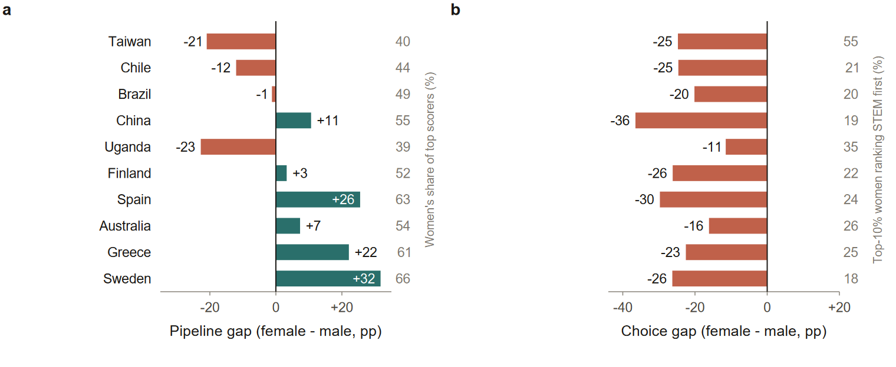

*Source: **The Global Gender Gap in STEM Applications: Pipeline vs. Choice**, by Isaac Ahimbisibwe, Adam Altmejd, Georgy Artemov, Andrés Barrios-Fernández, Aspasia Bizopoulou, Martti Kaila, Jin-Tan Liu, Rigissa Megalokonomou, José Montalbán, Christopher Neilson, Sebastián Otero, Jintao Sun and Xiaoyang Ye. [ConsiliumBots Working Papers no. 03](https://consiliumbots.github.io/working-papers-cb/). Figures reproduced from the paper.*

Women earned **35% of the world's STEM degrees** in 2024. A decade earlier the share was essentially the same. Whatever has been happening in the meantime, it has not been moving that number.

Two accounts compete. The *pipeline* account puts the problem upstream: fewer women reach the door of a selective STEM program with the preparation and the grades to get in. The *choice* account says that women who could get in are choosing something else.

The distinction is not a technicality. Work exploiting admission cutoffs finds that the field a student enters changes later earnings substantially, with the returns concentrated in the most selective programs, and that admission to those programs shapes who later reaches top incomes and corporate leadership. If the binding constraint is preparation, the policy is remediation and access. If it is choice among the already-qualified, remediation alone will not close the gap.

## Why the question has been hard to settle

To separate the two you have to see two things at once: who is actually eligible for a selective STEM program, and what those eligible students wanted.

Enrollment counts — the basis for most international comparisons — cannot do this. They record where students ended up, which folds preparation, application and the admission decision into a single number. Application data can do it, but studies with that data have mostly been confined to one country at a time, which leaves open whether a pattern belongs to that country's institutions or to something more general.

## What a centralized admission system lets you see

This is where the plumbing matters, and it is why the study was built around these systems rather than around enrollment statistics.

In a decentralized system a student decides *where to apply*, under uncertainty. Applying is costly, admission is a discretionary review, and a sensible applicant builds a portfolio: a few reaches, some safeties, and a quiet decision not to bother with places she expects will turn her down. Observe a gender difference in where people applied and you are observing preferences tangled together with beliefs about admission odds, the cost of applying, and portfolio strategy.

A coordinated platform removes most of that tangle. Students submit a single ranked list of program–institution combinations. Programs rank students by an academic performance score. A deferred-acceptance algorithm repeatedly assigns and bumps applicants until the assignment is stable, and each student lands in the highest-ranked option for which they qualify. Eligibility is a known function of the score, not a discretionary read of an essay.

Two things follow. Students *rank* rather than decide where to apply, so the cost of including an ambitious option is close to zero. And under this class of mechanism, ranking programs in true preference order generally gives applicants little incentive to misreport. The submitted list is therefore a great deal closer to a preference ordering than an application portfolio ever is.

That is what makes these platforms useful as measuring instruments, and there are now enough of them to compare. The study assembles harmonized administrative records from ten: Australia, Brazil, Chile, China, Finland, Greece, Spain, Sweden, Taiwan and Uganda.

## Two gaps

Take one system and look at the top 10% of its academic performance distribution. Two facts describe the STEM applicant pool there.

The **pipeline gap** is who is in the room: the female-minus-male difference in representation among students above the bar. Positive means women are over-represented among high achievers.

The **choice gap** is what they do there: the female-minus-male difference in the share of that group who rank a STEM program first. Negative means high-achieving women rank STEM first less often than high-achieving men.

<figure>

  

  <figcaption>Figure 2 from the paper. (a) the pipeline gap; (b) the choice gap — female minus male, percentage points, among students in the top 10% of each setting's performance distribution. The gray columns give the female level: women's share of top scorers on the left, and the share of top-10% women ranking STEM first on the right. For Chile, panel (b) conditions on top-decile students who submit an application list.</figcaption>
</figure>

The pipeline gap runs from −23 in Uganda to +32 in Sweden and changes sign along the way. Every choice gap falls between −36 and −11, and not one reaches zero.

## One gap travels. The other doesn't.

In Sweden, Spain and Greece, women are the clear majority of top performers — and still rank STEM first far less often than the men beside them. In Uganda and Taiwan, women are a minority of top performers, and the choice gap is there too. Whatever produces the pipeline gap is evidently sensitive to context. Whatever produces the choice gap is not.

Averaging across the ten settings, high-achieving women are **23.7 percentage points** less likely than high-achieving men to rank a STEM program first. Pooling students instead of settings gives 22.4 points. The gap exceeds 20 points in eight of the ten systems.

It also survives every obvious way of pushing on it.

1. **Move the bar.** Widen the definition of high achievement six-fold, from the top 5% to the top 30%, and the pooled gap moves by less than one percentage point.
2. **Change the measure.** Count a STEM program anywhere on the list rather than only first, and the gap holds in every setting.
3. **Sort by gender norms.** Line the settings up by gender parity in wages — a proxy for norms in the domain closest to specialization decisions — and the two gaps part company. The pipeline gap narrows and can turn positive; the choice gap barely responds, staying large and negative in the most gender-equal settings in the sample.

> Close the pipeline gap completely, leave application behaviour where it is, and the pool of high-achieving STEM applicants would still be **between 57% and 75% male** — in every one of the ten settings.

That last figure is the one to put in front of a ministry. Closing the preparation gap is worth doing on its own terms. It would not, by itself, produce a gender-balanced pool of STEM applicants anywhere in the sample.

## What this does not show

**Not innate preferences.** A similar-sized gap in ten different places is not evidence of a biological or fixed difference in what women want. Application choices are formed inside social, cultural and institutional environments, and similar-sized gaps can be produced by different combinations of forces in different places.

**Not a mechanism.** The admission rules let the study set aside much of the strategic story, but the records do not reveal the beliefs behind a ranking. Different information about what STEM study and work involve, different expected returns, less search before applying, anticipated discrimination, identity and belonging — all remain possible, and the paper sets out what evidence would separate them.

**Not causal.** The decomposition is descriptive. It allocates an observed gap between two margins; it does not estimate the effect of any intervention. Residual strategic incentives also remain where lists are short or applications precede scores, which the paper treats as qualifications rather than assuming these systems are frictionless.

<figure>
  
  <blockquote>
    
"The stability of the STEM choice gap across contexts with vastly different levels of income, human development and gender parity highlights the need to carefully identify and disentangle persistent mechanisms that are shaping girls' education choices, and which appear to be operating globally."

  </blockquote>
  <figcaption>Aspasia Bizopoulou, Senior Researcher at the VATT Institute for Economic Research and a coauthor of the paper.</figcaption>
</figure>

## Why the platforms matter here

Centralized application and assignment systems are usually discussed as allocation machinery: they make admissions fairer, cheaper and harder to game. That is true, and it is reason enough to build them.

But a system that asks every student to write down a ranked list, and that removes most of the reasons to write down something other than what they want, is also producing a national record of intentions — one that is otherwise extraordinarily hard to obtain. Ten of them, harmonized, were enough to show that the STEM gender gap in applications is not principally a preparation story. The same records are where an information or guidance intervention would have to be measured, because they capture the decision at the moment it is made rather than years later at graduation.

A gap that holds across Sweden and Uganda, across a six-fold change in who counts as a high achiever, and across the full range of wage parity in the sample, is not going to be closed by remediation alone. Finding out what would close it is the next question, and these systems are where it can be asked.

---

*This post is part of the [ConsiliumBots working paper series](/research). Per-country profiles, the full decomposition, an interactive threshold explorer and every figure with its underlying counts are available at [gendergapinsights.com](https://gendergapinsights.com).*
